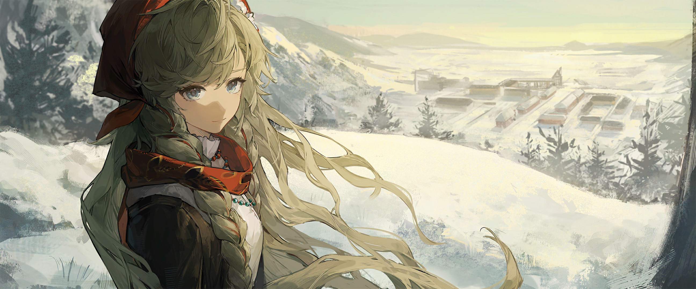

# **Reverse1999 Assets**

 > Sorted assets (kinda) for [Reverse 1999](https://www.biligame.com/detail/?id=107530) CN Version. Star is welcomed.

 > New repository to replace the old one. All assets had been moved to this repo so you can delete the previous one and clone this new repo.

 > Will update lastest stuff asap if i'm not lazy.

Some paths for certain stuff.

## Most common stuff, for others please search in the repo

| Assets | Path |
| :--- | :--- |
| `Lobby Model` | [live2d/roles](https://github.com/myssal/Reverse1999CN/tree/master/live2d/roles) |
| `Battle Sprite` | [roles](https://github.com/myssal/Reverse1999CN/tree/master/roles) |
| `Story Spirte` | [rolesstory](https://github.com/myssal/Reverse1999CN/tree/master/rolesstory) |
| `Arcanist Items` | [singlebg/data_pic](https://github.com/myssal/Reverse1999CN/tree/master/singlebg/data_pic) |
| `Psychube` | [singlebg/equipment](https://github.com/myssal/Reverse1999CN/tree/master/singlebg/equipment) |
| `Arcanist Illustration` | [singlebg/headicon_img](https://github.com/myssal/Reverse1999CN/tree/master/singlebg/headicon_img) |
| `Arcanist Expression Sheet` | [singlebg/headicon_small](https://github.com/myssal/Reverse1999CN/tree/master/singlebg/headicon_small) |
| `UTTU card`| [singlebg/seasoncelebritycard](https://github.com/myssal/Reverse1999CN/tree/master/singlebg/seasoncelebritycard) |
| `Story CG`| [singlebg/storybg](https://github.com/myssal/Reverse1999CN/tree/master/singlebg/storybg) |

